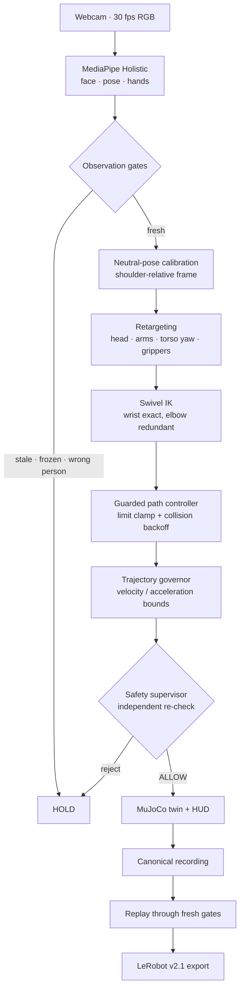

# Galbot Motion Studio

**A webcam is the only sensor. A simulated Galbot G1 is the only actuator.**
In between sits a fail-closed pipeline that turns a monocular RGB stream into
19 joint commands, and refuses to emit one it cannot justify.

```
┌─ your laptop camera ─┐                          ┌─ MuJoCo digital twin ─┐
│  30 fps, no depth,   │  ~127–138 ms end-to-end  │  head · both arms ·   │
│  no markers, no suit │ ───────────────────────► │  torso yaw · grippers │
└──────────────────────┘                          └───────────────────────┘
```

This repository is **simulation-only**. There is no robot SDK dependency, no
network transport, and no physical command path. Nothing here is authorization
to operate hardware, and the safety supervisor has no state that reaches it.

---

## Table of contents

- [Try it in 30 seconds](#try-it-in-30-seconds)
- [How it works](#how-it-works)
- [Why this is hard](#why-this-is-hard)
- [The safety model](#the-safety-model)
- [Evidence discipline](#evidence-discipline)
- [Repository layout](#repository-layout)
- [Tests](#tests)
- [Documentation](#documentation)
- [Attribution and licensing](#attribution-and-licensing)

---

## Try it in 30 seconds

No camera, no permissions, no hardware. The demo drives a deterministic
synthetic trajectory through every stage of the real pipeline:

```bash
python3.11 -m venv .venv
.venv/bin/pip install -e '.[vision,dev]'
./run_demo.sh
```

To validate the exported dataset with LeRobot too, install `.[export-validation]`.

It writes `artifacts/demo-<timestamp>/` containing a pose comparison, a preview
video, a canonical recording, and a declared-simulated LeRobot v2.1 dataset.
Every stage below actually runs — retargeting, IK, the guarded controller, the
supervisor, swept clearance, MuJoCo, record, replay, and export.

With a camera:

```bash
./demo_session.sh                 # live, fullscreen; a fresh session every run
./demo_session.sh --dry-run       # print the command, run nothing
```

Each invocation opens a **new** artifact directory and a new calibration
identity, so no take is ever silently overwritten.

---

## How it works



### 1 · Perception, and knowing when not to trust it

MediaPipe Holistic gives face, pose, and hand landmarks. The interesting work is
deciding when those landmarks are *lies*. Three independent gates run before
anything is retargeted:

| Gate | Question it answers | Failure it catches |
|---|---|---|
| **Freshness** | Did this frame arrive recently? | A stalled or backed-up capture thread |
| **Liveness** | Is the *content* actually changing? | A frozen driver, a paused virtual camera, a replayed buffer |
| **Selection** | Is this the same person we calibrated? | A second body entering frame and stealing the skeleton |

Freshness and liveness are genuinely different questions, and that distinction
is the whole point. A frozen camera keeps producing perfectly fresh timestamps,
and a frozen frame of a well-lit operator scores *high* confidence forever — the
landmarks really are there. Every timestamp- or confidence-based gate passes it.
`vision/liveness.py` compares an opaque per-frame content fingerprint against a
bounded *history* (not just the previous frame, which an A-B-A-B replay buffer
would defeat) and holds on a *duration* budget rather than a frame count, so
detection time stays bounded whether the operator is at 8 fps in a difficult
near-body pose or 30 fps in open space.

### 2 · Calibration is explicit and has no defaults

`vision/calibration.py` requires a neutral-pose window: a minimum sample count,
a maximum duration, and separate tolerances for body centre, shoulder width, and
eye span. **None of these have default values.** A caller that has not supplied
them has not supplied a calibration policy, and the CLI refuses to open the
camera. This is deliberate — it makes it impossible to accidentally calibrate a
production session from one good-looking frame.

### 3 · Retargeting a human onto a robot that is not shaped like one

Human landmarks are normalized image coordinates from a monocular camera. The
robot is a fixed-base G1 with a 2-DOF head, two 7-DOF arms, a torso yaw and two
grippers. The mapping is shoulder-relative and scale-free wherever possible, with
an asymmetric depth scale because forward reach and lateral reach are not
equally observable from a single camera. Palm orientation is *measured* from the
hand landmarks rather than inferred from the wrist, which is what lets the
gripper roll follow the operator's hand.

### 4 · Swivel IK — the interesting problem

A 7-DOF arm has exactly **one** redundant degree of freedom. The obvious
approach — match the wrist *and* match the elbow as a 3-D point — over-determines
the arm and puts the elbow in direct competition with the wrist. Measured on the
pinned model, that competition is unwinnable:

- The elbow sits rigidly 0.35 m from the shoulder, so it can only move
  **tangentially**. `rank(J_elbow) == 2`, singular values `[0.350, 0.0676, 0.0]`,
  and the radial component of the elbow Jacobian is exactly zero.
- At the teleop neutral pose the upper arm is **98.1 % lateral**, so a lateral
  elbow command is 98.1 % radial — "make the upper arm longer" — and 0 %
  achievable. The commanded target landed 0.5973 m from a shoulder that is
  physically 0.3500 m away.
- In the weighted normal equations the elbow term's trace was `0.002541` against
  a damping term of `0.011200`. **The regulariser that exists to stop motion was
  four times stronger than the objective meant to cause it.**

The correct quantity is one-dimensional: the **swivel angle ψ**, the elbow's
rotation about the shoulder→wrist axis. It parameterises exactly the self-motion
manifold that leaves the end-effector pose unchanged, so it *cannot* fight the
wrist. It is also dimensionless — invariant to human and robot limb lengths
alike, so no scale factor is needed anywhere. The wrist pose is a hard equality
constraint; the elbow swivels beneath it.

### 5 · Not freezing at the wall

The naive failure mode of any teleop system is: mirror the human, hit a
constraint, latch into a frozen HOLD, stay frozen. `retarget/guarded_controller.py`
sits between the raw target and the governor and makes the target *feasible*
before the supervisor ever sees it:

1. **Limit clamp** — clamp each joint inside its soft-limit band, so the governor
   never chases a target sitting on a limit.
2. **Collision backoff** — move as far along the straight line toward the goal as
   is collision-free *this* frame, and continue next frame.

The backoff is exact, not heuristic. The injected clearance check sweeps the
whole segment from the current pose, so a longer step is a strict superset of a
shorter one: once a prefix of the line collides, every larger fraction does too.
The safe fractions therefore form a prefix `[0, α_max]` and a bisection converges
on the boundary. All joints scale by the same α, so the arm moves *along the
straight line toward the operator's pose* — the shape of the motion is preserved,
only its extent is limited.

### 6 · Clearance is a distance, not a boolean

On 2026-08-07 a left-arm sweep put a gripper 5.2 cm from the robot's own head and
drove `left_arm_link5` into `leg_link2` at −33.8 mm penetration. The start pose
was clear. The end pose was clear. **The middle was not, and nothing was checking
the middle.**

`safety/clearance.py` reports minimum *distance* across the whole interpolated
path, not contact at the endpoints. Two measured facts made this practical:

- `mj_geomDistance` calls the narrowphase directly and ignores `contype` /
  `conaffinity` entirely, so the model can be loaded read-only with no on-disk
  MJCF patching.
- MuJoCo's contact pipeline is *blind* to penetrating pairs its compile-time
  broadphase pruned — 17 further penetrating pairs went unreported in the audit.
  A contact-count check would have called that pose safe.

### 7 · The supervisor is independent

`safety/supervisor.py` is not a helper the pipeline calls for advice. It
independently re-checks provenance, timing, joint limits, dynamics, and the
complete interpolated clearance path, and mints a capability-bound
`ApprovedCommand` for the simulator only. It exposes **no** transition to
physical `LIVE`.

### 8 · Record, replay, export

A session is recorded as a canonical clip. Replay re-runs that clip through
**fresh** gates rather than trusting the recorded verdicts. Export produces
LeRobot v2.1 data that declares its simulated provenance in the metadata — it is
not, and does not claim to be, a robot measurement dataset.

---

## Why this is hard

Most of the difficulty is not in any single stage. It is that the stages disagree
about what "safe" means, and the honest resolution is usually to **hold**.

| Constraint | Consequence |
|---|---|
| Monocular RGB, no depth, no markers | Depth is inferred; forward and lateral reach are not equally observable |
| 7-DOF arm, 6-DOF wrist task | One redundant DOF, and it must not be over-specified |
| Human ≠ robot kinematics | Scale-free, shoulder-relative mapping wherever possible |
| Self-collision is path-dependent | Endpoint checks are worthless; the whole sweep must be swept |
| Landmarks fail silently | Freshness, liveness and identity are separate gates |
| Real-time | ~127–138 ms photon-to-twin-pose at 30 fps; IK alone is 88–110 ms |

**Measured latency** — 30 fps replay of a real session, photon to twin pose:
**127–138 ms mean, 95–106 ms median**, run-to-run scatter ≈ 10 ms. The IK solve
is ~72 % of the control worker. The twin lags the operator by about a tenth of a
second, and the session prints the figure itself on the HUD rather than asking
you to take the number on trust.

Every hold has a *named reason* rather than a generic failure, because "the arm
stopped" is not a debuggable statement:

```
TORSO_YAW_OUT_OF_VIEW          TORSO_YAW_DISCONTINUITY
TORSO_YAW_UNAVAILABLE          TORSO_YAW_CONTINUITY_GAP
TORSO_YAW_NEUTRAL_UNAVAILABLE  TORSO_YAW_RECALIBRATION_REQUIRED
TORSO_FRONT_UNOBSERVABLE       HEAD_BASIS_TRANSITION
HEAD_SOFT_LIMIT                HAND_NOT_TRACKABLE
CALIBRATION_SELECTION_MISMATCH
```

Holds are also **per control group**: a dropped left wrist holds the left arm
while the head and right arm keep tracking. A command is untrustworthy only when
the landmark that drives *that* command is untrustworthy.

---

## The safety model

Two independent state machines, and the model itself is pinned by hash.

**Supervisor state:** `QUERY_ONLY` → `PREVIEW` → `HOLD` / `FAULT`
**Per-frame decision:** `ALLOW` · `HOLD` · `FAULT`

Everything fails closed:

- The model package is verified by SHA-256 before any simulator load. The
  pinned tree, both URDFs and the MJCF each have a recorded hash; a mismatch is
  a hard error, not a warning.
- Calibration policy has no defaults, so it cannot be inherited by accident.
- A frame that fails validation never advances liveness state — a frozen camera
  behind a jittery clock stays held instead of being rescued by the glitch.
- Missed heartbeat holds. It never auto-returns home: disconnection must not
  create new autonomous motion.
- `tests/unit/test_core_is_sdk_free.py` asserts the simulation-only boundary in
  CI. It is a test, not a promise.

`docs/safety-model.md` enumerates the failure cases; `docs/safety-coverage.md`
marks each one IMPLEMENTED, PARTIAL, or DEFERRED — and a test asserts that every
row in the matrix has an explicit disposition, so the coverage table cannot
silently drift from the matrix it describes. Deferred hardware and physical
dead-man requirements are exactly why physical `LIVE` does not exist.

---

## Evidence discipline

A claim that a change *improved* the mapping requires a source-aligned A/B, not a
nice-looking video. The capture frame map and landmark sidecar are
cryptographically bound to the raw video:

```
raw.mp4 + raw.frame-map.json + raw.landmarks.json
    ├─► wrist-primary    --analysis-sync ─┐
    └─► direction-vector --analysis-sync ─┴─► analyze-ab report
```

Candidate analysis **rejects** a composite video, an unmapped video, a missing
sidecar, mismatched source sequences, or mismatched implementation/model/tool
identity. The report gives per-arm availability, limb and whole-frame hold
reasons, upper-arm and forearm angle error, elbow-flexion error, wrist residual,
and predicted clearance.

A report is evidence to review. It is not an automatic approval: a candidate is
not promoted unless its shape metrics improve on a meaningful common sample
*without* regressing hold behaviour, whole-frame safety outcomes, wrist residual,
clearance, joint limits, or rate limits. No candidate is promoted on a headline
hold count alone.

The full release procedure is in [`docs/operating-guide.md`](docs/operating-guide.md).

---

## Repository layout

```
src/galbot_motion_studio/
├── contracts/      immutable value types — the only vocabulary crossing layers
├── ports/          interfaces: frames in, commands out, occupancy queries
├── adapters/       webcam · recorded video · MediaPipe Holistic · MuJoCo preview
├── vision/         freshness · liveness · selection · calibration
├── retarget/       head · arms · torso · hand · palm frame · swivel IK ·
│                   guarded controller · trajectory governor · filtering
├── safety/         supervisor · swept clearance · profiles
├── model/          hash-pinned manifest · loader · joint map
├── testing/        deterministic harness and fault injection
├── pipeline.py     the composition root
├── display.py      operator HUD
├── recording.py    canonical clip format
├── replay.py       re-run a clip through fresh gates
└── export_v21.py   LeRobot v2.1 writer

tools/              HUD server, camera probing, A/B analysis, solver benchmarks
configs/            model and vision configuration
third_party/        vendored G1 description package (hash-pinned)
docs/               design, safety, model ground truth, operating guide
tests/              45 files, ~15k lines
```

**Ports and adapters throughout.** The clearance check is *injected* into the
guarded controller, the liveness monitor takes an opaque fingerprint string, and
the core carries no MuJoCo or SDK import. That is what makes a real-time robotics
pipeline unit-testable without a camera, without a model, and without hardware.

---

## Tests

```bash
PYTHONPATH=src .venv/bin/python -m pytest -q
```

~20k lines of source against ~15k lines of tests across 45 files. The suite
covers the deterministic pipeline end to end, fault injection and latch
behaviour, clearance geometry against the pinned model, the IK solver, every
vision gate, and the export format.

Tests that require a recorded witness capture **skip** rather than pass — `*.mp4`
and `artifacts/` are kept out of the repository on purpose, so the live path is
honestly reported as untested on a fresh checkout. A skipped test is not
evidence, and it does not pretend to be.

---

## Documentation

| Document | What it covers |
|---|---|
| [`docs/architecture.md`](docs/architecture.md) | Normative design and safety plan |
| [`docs/safety-model.md`](docs/safety-model.md) | Failure matrix |
| [`docs/safety-coverage.md`](docs/safety-coverage.md) | Per-row disposition: implemented, partial, deferred |
| [`docs/operating-guide.md`](docs/operating-guide.md) | Capture, A/B, and release procedure |
| [`docs/model-notes.md`](docs/model-notes.md) | Measured ground truth for the G1 model |
| [`docs/workspace-envelope.md`](docs/workspace-envelope.md) | Reachable workspace and gate placement |
| [`docs/export-format.md`](docs/export-format.md) | LeRobot v2.1 export contract |
| [`docs/vision-readiness.md`](docs/vision-readiness.md) | Perception production-readiness assessment |
| [`docs/vision-handoff.md`](docs/vision-handoff.md) | Perception engineering handoff |
| [`docs/replay-validation.md`](docs/replay-validation.md) | Simulator replay validation |
| [`docs/lookahead-option.md`](docs/lookahead-option.md) | Look-ahead design option, and why it was reverted |

---

## Attribution and licensing

Written by Auric Hardcastle ([@AuricHardcastle](https://github.com/AuricHardcastle))
as an independent contributor to Galbot's developer SDK. Released under
[Apache-2.0](LICENSE).

Third-party components are vendored and attributed rather than silently copied:

- **`mink`** (Apache-2.0) supplies the QP with hard equality constraints,
  `ConfigurationLimit`, and per-task Levenberg-Marquardt damping. The
  swivel-angle task, its analytic Jacobian, the degeneracy handling and the
  human-side mapping are original — no library ships a swivel task.
- **`mink` pulls `qpsolvers`, which is LGPL-3.0** (and `daqp`, MIT). LGPL on an
  imported, unmodified library permits commercial use and does not reach this
  source, but it is copyleft sitting in the dependency tree. This is recorded
  here, and in `pyproject.toml`, rather than buried — it is a decision to make
  knowingly, not to inherit by accident. It is why `swivel` is an **optional**
  extra and the base install does not depend on it.
- **`three.js` loaders** under `tools/vendor/` — see
  [`tools/vendor/LICENSES.md`](tools/vendor/LICENSES.md).
- **G1 description package** under `third_party/` — vendored unmodified and
  pinned by SHA-256.
